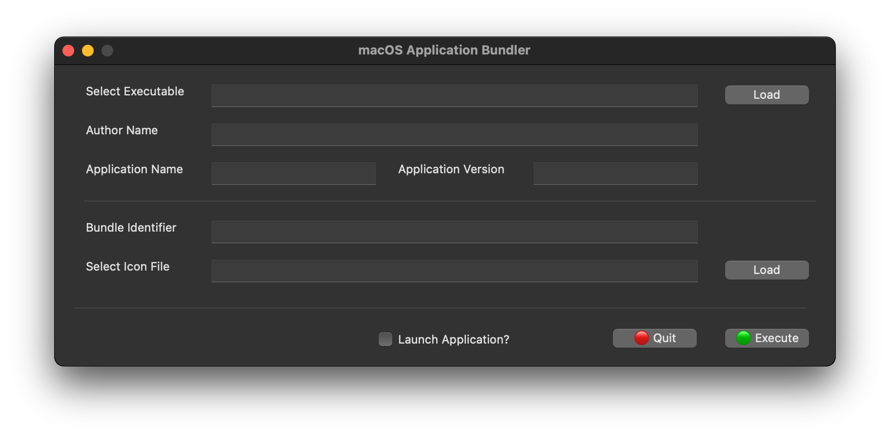
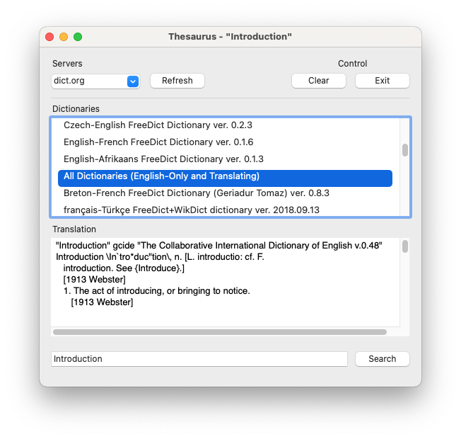
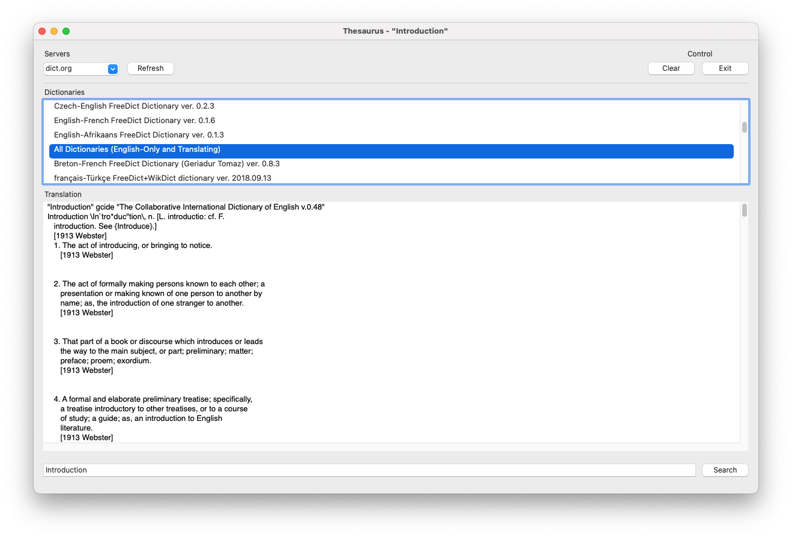

# NimCocoa

NimCocoa is an experimental implementation of a ***Native*** GUI for the Nim programming language running on macOS.

Rather than rely on low level calls to objc_msgsend and it's variants, it uses actual Objective-C code modules I created that are wrapped using C-Style functions, which Nim can then use.

At the moment, the following GUI objects are available:

|            |             |              |               |                        |
| ---------- | ----------- | ------------ | ------------- | ---------------------- |
| NSWindow   | NSMenu      | NSSavedialog | NSSlider      |                        |
| NSButton   | NSTextfield | NSMessagebox | NSListbox     | NSContainer (Groupbox) |
| NSLabel    | NSCheckbox  | NSOpendialog | NSTextedit    | NSTableView            |
| NSCombobox | NSDialog    | NSLine       | NSRadioButton |                        |


Preliminary documentation for GUI objects is available in the `doc` folder and in the `wiki`.

Here is an example of what coding with NimCocoa looks like:

```nim
import Cocoa
import json, os, plists, times

var mainWin: ID

var lblFile, txtFile, btnFile, lblAuthor, txtAuthor, lblApp, 
    txtApp, lblImage, txtImage, btnImage, line1, lblVersion, 
    txtVersion, lblIdent, txtIdent, line2, chkLaunch, btnExec,
    btnQuit: ID

const
  width:cint = 800
  height:cint = 310
  winStyle = NSWindowStyleMaskTitled or NSWindowStyleMaskClosable or NSWindowStyleMaskMiniaturizable

proc getExecutable(sender: ID) {.cdecl.} =
  let fName = newOpenDialog(mainWin, "")
  if fName.len > 0:
    txtFile.text = fName

proc getImage(sender: ID) {.cdecl.} =
  let fName = newOpenDialog(mainWin, "icns")
  if fName.len > 0:
    txtImage.text = fName
  
proc quit(sender: ID) {.cdecl.} =
  Cocoa_Quit(mainWin)

proc createAppBundle(sender: ID) {.cdecl.} =
  let dt = now()

  let appAuthor = $txtAuthor.text
  let appName = $txtFile.text
  let iconFile = $txtImage.text
  let bundleName = $txtApp.text
  let bundleIdentifier = $txtIdent.text
  let appVersion = $txtVersion.text
  let appInfo = appVersion & " Created by " & appAuthor & " on " & dt.format("MM-dd-yyyy")
  let appCopyRight = "Copyright" & dt.format(" yyyy ") & appAuthor & ". All rights reserved."
  let appBundle = bundleName & ".app"

  var pl = %*
    { "CFBundlePackageType" : "APPL",
      "CFBundleInfoDictionaryVersion" : "6.0",
      "CFBundleName" : bundleName,
      "CFBundleExecutable" : bundleName,
      "CFBundleIconFile" : extractFilename(iconFile) ,
      "CFBundleIdentifier" : bundleIdentifier ,
      "CFBundleVersion" : appVersion ,
      "CFBundleGetInfoString" : appInfo,
      "CFBundleShortVersionString" : appVersion ,
      "NSHumanReadableCopyright" : appCopyRight ,
      "NSPrincipalClass" : "NSApplication" ,
      "NSMainNibFile" : "MainMenu" 
    }

  createDir(appBundle & "/Contents/MacOS")
  createDir(appBundle & "/Contents/Resources")
  createDir(appBundle & "/Contents/Frameworks")

  if appName.fileExists:
    appName.copyFileWithPermissions(appBundle & "/Contents/MacOS/" & bundleName)

    if iconFile.fileExists:
      iconFile.copyFileWithPermissions(appBundle & "/Contents/Resources/" & extractFileName(iconFile))

    if "Credits.rtf".fileExists:
      "Credits.rtf".copyFileWithPermissions(appBundle & "/Contents/Resources/Credits.rtf")

        
    pl.writePlist(appBundle & "/Contents/Info.plist")

    discard execShellCmd("touch " & appBundle)

    if chkLaunch.state == 1:
      discard execShellCmd("open " & appBundle)


proc main() =

  Cocoa_Init()

  mainWin = newWindow("macOS Application Bundler", width, height, winStyle)

  lblFile = newLabel(mainWin, "Select Executable",30, 20, 120, 25)
  txtFile = newTextField(mainWin, "", 160, 20, 500, 25)
  btnFile = newButton(mainWin, "Load", 680, 20, 100, 25, getExecutable)
  txtFile.anchor=akWidth; btnFile.anchor=akRight

  lblAuthor = newLabel(mainWin, "Author Name", 30, 60, 120, 25)
  txtAuthor = newTextField(mainWin, "", 160, 60, 500, 25)
  txtAuthor.anchor=akWidth

  lblApp = newLabel(mainWin, "Application Name", 30, 100, 120, 25)
  txtApp = newTextField(mainWin, "", 160, 100, 170, 25)
  txtApp.anchor=akWidth

  lblImage = newLabel(mainWin, "Select Icon File", 30, 200, 120, 25)
  txtImage = newTextField(mainWin, "", 160, 200, 500, 25)
  btnImage = newButton(mainWin, "Load", 680, 200, 100, 25, getImage)
  txtImage.anchor=akWidth; btnImage.anchor=akRight

  line1 = newSeparator(mainWin, 30, 140, 750)

  lblVersion = newLabel(mainWin, "Application Version", 350, 100, 130, 25)
  txtVersion = newTextField(mainWin, "", 490, 100, 170, 25)
  txtVersion.anchor=akRight; lblVersion.anchor=akRight

  lblIdent = newLabel(mainWin, "Bundle Identifier", 30, 160, 120, 25)
  txtIdent = newTextField(mainWin, "", 160, 160, 500, 25)
  # btnCredits = newButton(mainWin, "Load", 680, 160, 100, 25, nil)
  txtIdent.anchor=akWidth

  line2 = newSeparator(mainWin, 20, 240, 750)

  chkLaunch = newCheckBox(mainWin, "Launch Application?", 390, 270, 150, 25)
  btnExec = newButton(mainWin, "🟢 Execute", 680, 270, 100, 25, createAppBundle)
  chkLaunch.anchor=akLeft + akRight + akBottom; btnExec.anchor=akRight + akBottom

  btnQuit = newButton(mainWin, "🔴 Quit", 565, 270, 100, 25, quit)

  Cocoa_Run(mainWin)
  

if isMainModule:
  main()
```

Which results in the following:



Another screenshot:



Same app resized, showing how objects flow based on their associated 'anchor' setting:



I am working on documenting the available objects/functions as well as examples.

Stay Tuned!
